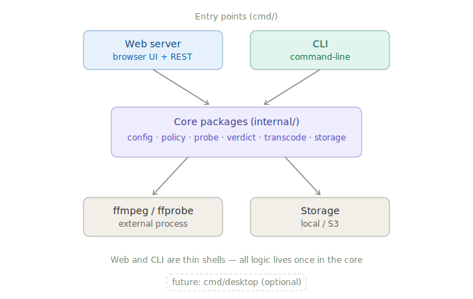

# Video Encoding Agent

업로드된 영상의 코덱을 자동으로 진단하고, 운영자가 지정한 정책에 맞춰 인코딩하여
재생 호환성을 보장하는 자가완결형(self-contained) 에이전트. Go 단일 바이너리로
빌드되어 **어떤 서버 환경에든 설치하면 그 안에서 완결적으로 동작**한다.

## 무엇을 하는가

1. **영상 업로드 감지** — 지정된 입력 디렉터리에 영상이 들어오면 자동으로 집어든다.
2. **1차 자동 인코딩** — 설정해 둔 코덱 정책(비디오/오디오/컨테이너/픽셀포맷/프레임레이트)을
   기준으로 진단하고, 위반 시 정책에 맞게 자동 인코딩한다. 이미 준수하는 영상은 변환 없이 통과.
3. **UI 영상 관리** — 운영자(관리자)가 UI에서 처리된 영상 목록과 **상세 코덱 정보**를 확인한다.
4. **2차 수동 인코딩** — 운영자가 영상을 선택해 키프레임(IDR) 정렬 등 2차 인코딩을 직접 실행한다.

## 설계 원칙: 자가완결성

이 에이전트는 설치된 서버 안에서 완결된다.

- 영상·진단결과·이력 등 데이터는 에이전트가 동작하는 서버 경계를 벗어나지 않는다.
- 중앙 DB나 외부 작업 큐에 의존하지 않는다. 독립 완결 시스템이다.
- 이 원칙이 모든 아키텍처 결정의 기준이다. 중앙집중식 패턴은 채택하지 않는다.

따라서 동일 바이너리를 여러 서버에 각각 배포해도, 각 인스턴스가 자기 서버의 데이터만
다룬다. 데이터 경계가 곧 배포 경계다.

## 아키텍처: 공유 코어 + 다중 진입점

모든 로직은 **코어 패키지(`internal/`)에 한 번만** 작성한다. 웹 서버와 CLI는 그 코어를
호출하는 얇은 껍데기일 뿐이다. 같은 진단·인코딩 동작이 웹에서든 CLI에서든 정확히
동일하게 실행되며, 코어 한쪽을 고치면 양쪽이 함께 반영된다.



- **웹 서버** — `net/http` 기반 HTTP 서버. 운영자용 브라우저 UI와 REST API를 제공한다.
  프론트(HTML/JS)는 `go:embed`로 바이너리에 내장되어 **단일 바이너리** 배포를 유지한다.
- **CLI** — 명령행에서 진단/인코딩을 직접 실행한다. 자동화·스크립트·cron/systemd 연동에 적합.
- **(향후) 데스크톱 앱** — 코어를 그대로 둔 채 진입점만 하나 더 얹는 형태로 확장 가능.
  웹 UI를 Wails 등으로 감싸 데스크톱 앱으로 제공할 수 있다. 단, 서버용 정적 바이너리와는
  배포 모델이 다른 **별도 산출물**로 다룬다. 현재 구현 대상은 아니다.

```
video-encoder-agent/
├── cmd/
│   ├── server/      # 웹 서버 진입점 (브라우저 UI + REST API)
│   ├── cli/         # CLI 진입점
│   └── desktop/     # (향후) 데스크톱 앱 진입점 — 선택
├── internal/
│   ├── config/      # 설정 스키마·검증            [완료]
│   ├── policy/      # 코덱 정책 + allows 헬퍼      [완료]
│   ├── probe/       # ffprobe 실행·파싱            [완료]
│   ├── verdict/     # 7항목 정책 판정              [완료]
│   ├── transcode/   # ffmpeg 변환 파이프라인        [다음]
│   └── storage/     # Storage 인터페이스 (로컬/S3)
├── web/             # 정적 프론트 (서버가 go:embed)
├── docs/architecture.svg
├── go.mod
├── README.md
└── .gitignore
```

## 코덱 정책

정책은 설정 파일(JSON)로 주입되어 **재컴파일 없이** 변경 가능하다.
빈 필드는 "해당 항목 검사 안 함"으로 처리된다. 기본 정책 예시:

| 항목 | 값 |
|------|-----|
| 비디오 | H.264 (AVC) |
| 오디오 | AAC-LC (profile까지 검사) |
| 컨테이너 | MP4 |
| 픽셀포맷 | yuv420p |
| 프레임레이트 | CFR(고정) 30fps |
| 키프레임(IDR) | 10초 / 300프레임 고정, 장면전환 키프레임(sc) 끄기 |

키프레임 정책이 지켜지지 않으면 재생 중 특정 구간에서 영상이 멈출 수 있다.

## 진단 = 2단계

### 1차 진단 (자동, 가벼움)
ffprobe 메타데이터만으로 검사한다: 비디오코덱 / 오디오코덱 / AAC 프로파일 /
컨테이너 / 픽셀포맷 / fps / CFR(휴리스틱: `r_frame_rate == avg_frame_rate`).

- 통과 → `completeUpload/` 로 이동
- 위반 → ffmpeg 변환 → 재검증 → `completeUpload/` (실패 시 `failedUpload/`)

키프레임 간격은 1차에서 검사하지 않는다 — 패킷 스캔 비용이 크고 메타데이터만으로는
판별이 불완전하기 때문. 키프레임은 운영자 판단 기반의 2차 워크플로우로 분리한다.

### 2차 키프레임 인코딩 (수동, UI에서 실행)
운영자가 완료된 영상을 재생해 멈춤 증상을 확인 → UI에서 해당 영상 선택 → 키프레임 강제 정렬.

- `ffmpeg -g 300 -sc_threshold 0` 으로 재인코딩
- 원본 백업(`backup/`) → 변환본 재검증 → 통과 시 원본 파일명 그대로 덮어쓰기
- 참조 경로·파일명 불변. 작업 중 임시명은 `원본제목_update.mp4`

## 관리자 UI (웹)

운영자는 브라우저 UI 또는 REST API를 통해 다음을 수행한다.

- 처리 완료 / 실패 영상 목록 조회
- 영상별 **상세 코덱 정보** 확인 (비디오·오디오 코덱, 프로파일, 픽셀포맷, fps, CFR 여부 등)
- 영상 선택 후 **2차 인코딩(키프레임 정렬)** 실행

동일 기능을 CLI로도 수행할 수 있다 (스크립트·자동화용).

## 파일 흐름 (4경로)

```
tempUpload/    (입구, 검사 대기)
  → processing/      (작업 중, 중복 처리 방지)
  → completeUpload/  (검증 통과, 서비스 대상)
  또는 failedUpload/  (변환·검증 실패, 운영자 확인 대상)
```

변환 안전순서: 복사 → 변환 → ffprobe 재검증 → 원자적 이동(rename) → 임시 정리.
실패해도 원본은 보존되어 다음 폴링에서 재시도된다.

## 저장소 추상화

`Storage` 인터페이스로 추상화되어, 구현체는 설정의 `storage.type`으로 선택한다.

- S3 호환 스토리지가 있는 환경 → S3
- 그 외 → 로컬 파일시스템

## 설정 (JSON)

경로 4개 + `storage` + `policy`(코덱 정책) + `keyframe_check`(2차 옵션)로 구성된다.

## 빌드

ffmpeg / ffprobe 가 PATH에 있어야 한다.

```bash
# 웹 서버 (브라우저 UI + REST)
CGO_ENABLED=0 go build -o bin/agent-server ./cmd/server

# CLI
CGO_ENABLED=0 go build -o bin/agent-cli ./cmd/cli
```

두 진입점은 같은 코어 패키지를 공유하므로 동작이 항상 일치한다.

## 구현 로드맵

- [x] ffprobe 진단기 + 7항목 정책 판정 (`config` / `policy` / `probe` / `verdict`)
- [ ] ffmpeg 변환 파이프라인 (정책 기반 명령 자동생성 + 재검증)
- [ ] 4경로 파일 흐름 (디렉터리 감시·이동)
- [ ] 2차 키프레임 인코딩 워크플로우
- [ ] 웹 서버 진입점 + 관리자 UI (영상 목록 / 상세 코덱 / 2차 인코딩 트리거)
- [ ] CLI 진입점 (진단 / 인코딩 서브커맨드)

### 인프라 (코어 로직 완료 후)
- [ ] Docker 이미지 (alpine / ubuntu, 동일 정적 바이너리)
- [ ] docker-compose 검증
- [ ] Kubernetes(kind) — namespace 격리로 배포 경계 표현
- [ ] MinIO (S3 호환 로컬 테스트)

### 향후 (선택)
- [ ] 데스크톱 앱 진입점 (`cmd/desktop`, 웹 UI 재사용)

## 기여 가이드

- `main` 브랜치 보호, feature 브랜치 + PR 리뷰
- 커밋 컨벤션: `feat:` / `fix:` / `docs:` / `refactor:` / `test:` / `chore:`
- 테스트 영상은 커밋하지 않는다 (`.gitignore`로 차단). `testdata/media/` 에 로컬 보관.